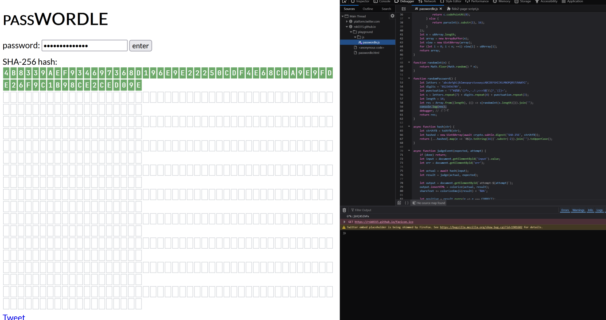

# Passwordle attempt 1

First attempt at solving rsk0315's [passwordle game](https://rsk0315.github.io/playground/passwordle.html)

y'know, I've just had too much time on my hands lately.

on my path of finding a project to be proud of

also turning on "Pause on debugger statement" is literally cheating.

# Credit

Spidermonkey randomness predictor from [mkutay](https://github.com/mkutay/spidermonkey-randomness-predictor)

# Progress notes

ok this is basically not even possible unless i look at the source code

i looked at the source code and its still not looking possible in any way

```js
function randomPassword() {
    let letters = 'abcdefghijklmnopqrstuvwxyzABCDEFGHIJKLMNOPQRSTUVWXYZ';
    let digits = '0123456789';
    let punctuation = '!"#$%&\'()*+,-./:;<=>?@[\\]^_`{|}~';
    let s = letters.repeat(7) + digits.repeat(4) + punctuation.repeat(3);
    let length = 14;
    let res = Array.from({length}, (() => s[randomInt(s.length)])).join('');
    debugger; // どうぞ
    return res;
}
```

94^14 distinct strings (weighted)

~4.21 * 10^27

SHA brute forcing looks to be even worse.

# I WON

i won ig but i cheated. its like impossible to win legit lol. get astronomically lucky ig.



## Math.random() hacking

Actually it might be possible to do this "legitimately" using [this](https://github.com/mkutay/spidermonkey-randomness-predictor)

(i use firefox)

```js
function randomInt(n) {
    return Math.floor(Math.random() * n);
}
```
interesting

```py
pip install z3-solver
```

k im like trying ok
```js
let seq = [];
for (let i = 0; i < 50; i++) {
    seq.push(Math.random());
}
console.log(JSON.stringify(seq, null, 2));
```